# Week 3: Continue Review of Basic Web Development Techniques

## Review of GitHub & DevTools process and building a basic HTML/CSS site

### GitHub Review

First thing we want to do is update our local projects to have the latest changes that have been pushed from the parent fork `kcc-nma-art258/assignments`

### Setting up Chrome DevTools

When developing in the browser, you'll want to debug and see changes to your code while you're working. With Chrome Developer Tools, we have the ability to debug as well as edit our code live in the browser.

Let's start by opening up the Chrome Developer Tools, by clicking on the menu icon in the top right corner; then *More Tools > Developer Tools* or by using the shortcut `(cmd + opt + I)`

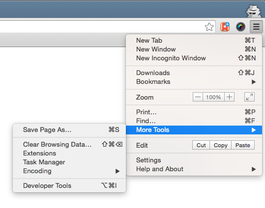

This will pop-open a pane for doing debugging and authoring.

The main panels we'll be working with for the moment are the *Elements* and *Sources* Panel.

**Elements Panel**

This is where we can see a live preview of our HTML & CSS. You can edit both here and see the changes take effect live on the page. This is also how you can see if something is going wrong.

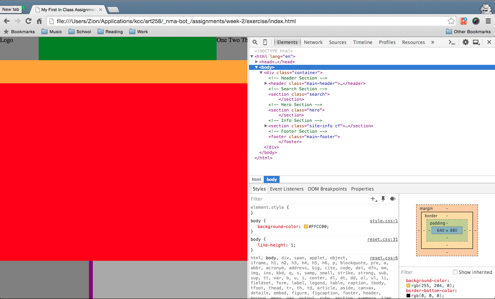

**Sources Panel**

The sources panel acts as the editor of Chrome DevTools, allowing you to saving the changes CSS & JS files and they'll be applied live on the page without reloading. HTML files can be edited here as well, however their changes require a page refresh.

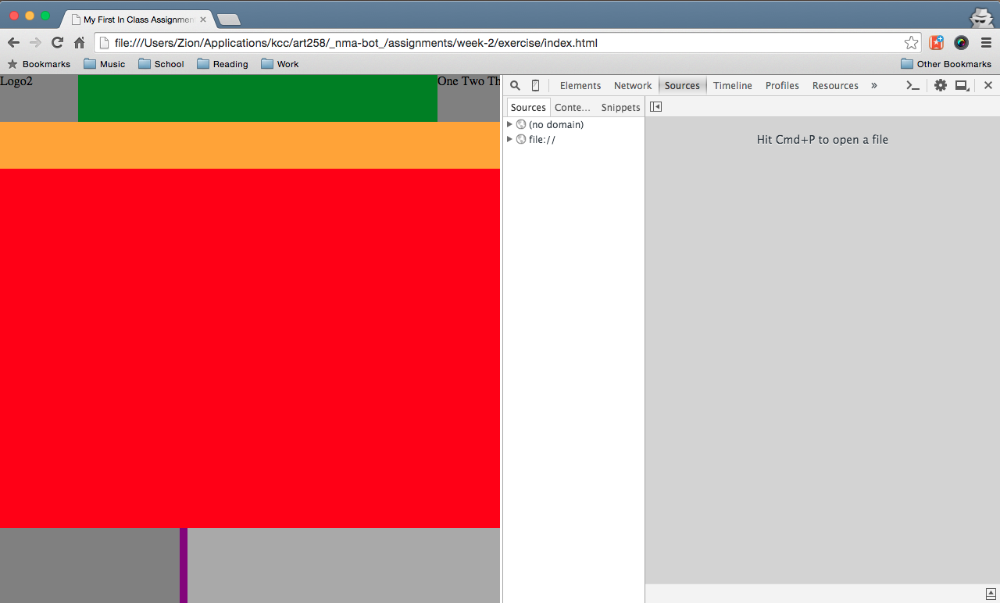

To setup live editing, add your projects workspace to the DevTools by right-clicking in the *Sources* sidebar pane and selecting `Add Folder to Workspace`.

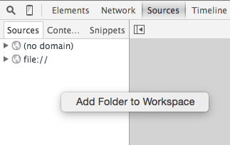

*You can add individual projects at a time, but I simply add my entire *projects* folder to make things easier.*

Once you add the folder, Chrome will ask you to confirm access for DevTools. Just click `Allow`.

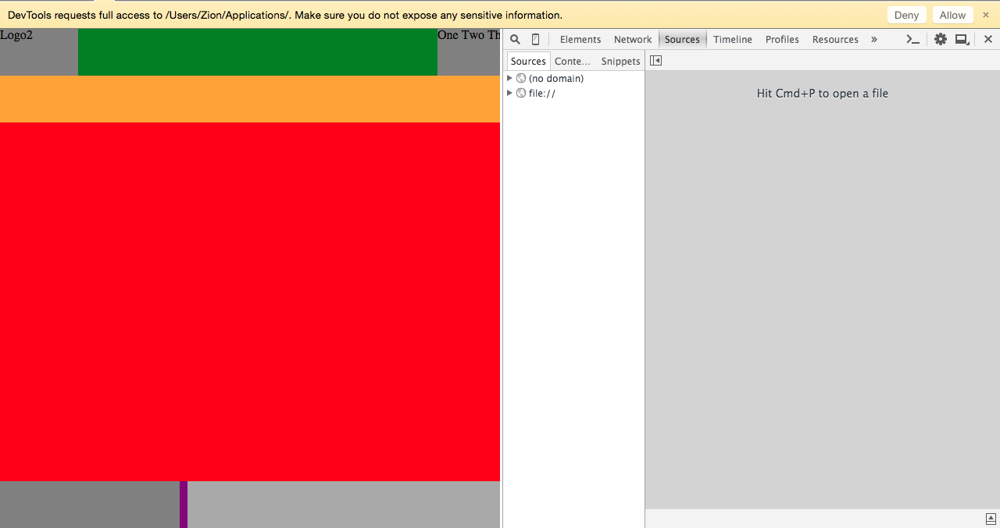

Once you click allow, you'll see the folder added to your left hand pane. You can now browse your local web projects in Chrome like any other editor!

#### Live-editing in Chrome

To see live editing in Chrome, you can select a CSS or JavaScript file from the sources sidebar pane...

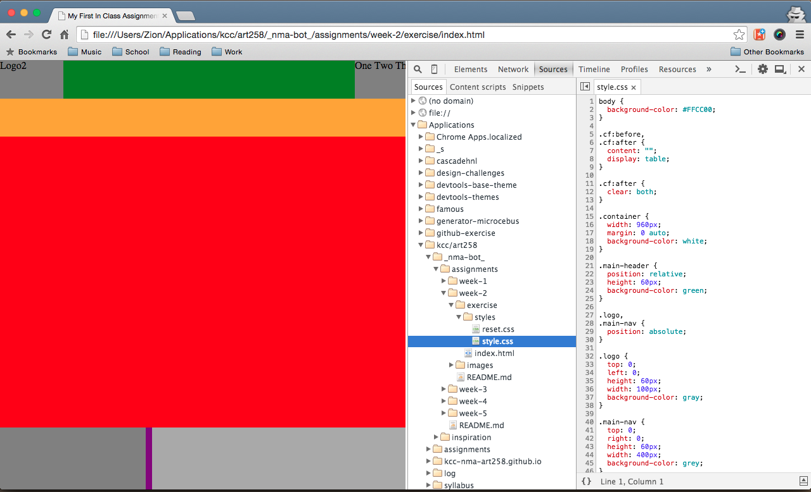

or by selecting a CSS file from the Styles sub-panel in the *Elements* panel.

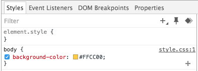

*Clicking on `style.css:1` will pull up the CSS file loaded from the network*

Once you have the CSS file pulled up, right-click within the *Sources* panel code view and select `Map to Network Resource`.

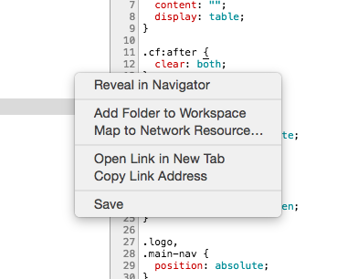

*If you started from the Elements panel, the option will say `Map to File System Resource` instead.*

Chrome will then pop open the file quick-finder to select the local or network file that matches the current file. Once you select the file, Chrome will ask you to restart for the changes to take affect.

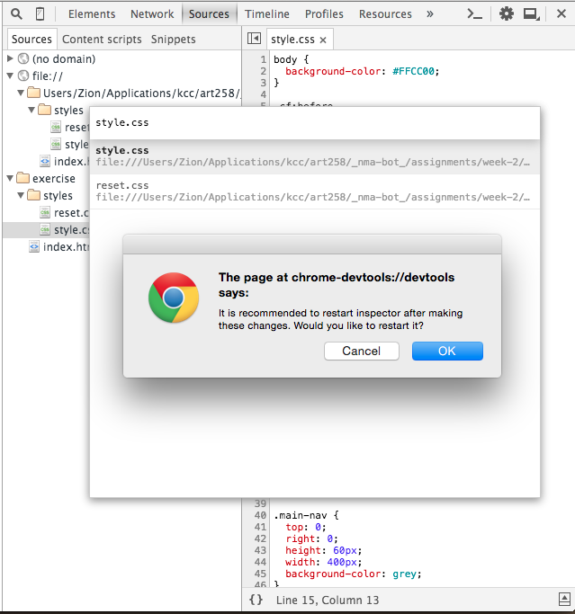

By default, Chrome Devtools will load the files from the server, which is what you're accessing and manipulating in the *Elements* panel. With Workspaces enabled, we have local copies of the same files available for editing.

Below is a shot of the network files and local file resources expand; network files have a globe icon and local files have a folder icon.

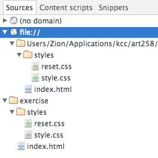

When we map a network and local resources together, Chrome will reflect the local changes we're making on the live site we're viewing. You'll know everything is setup if you only see your local file afterwards, but no corresponding network resource.

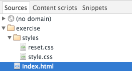

Now when you make edits to your CSS & JS, they'll be reflected live in the browser without refreshing!

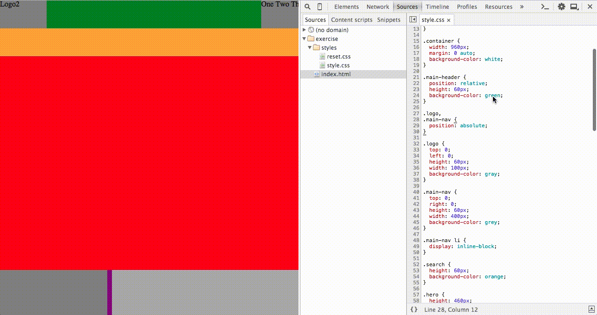

The changes you make are also saved to the file system just like a normal editor with the `(cmd + S)` shortcut. You can also edit and make changes to other files including HTML files, however these changes won't be reflected live.

#### Resources:
- [Chrome Developer Tools: Authoring and Development Workflow](https://developer.chrome.com/devtools/docs/authoring-development-workflow)
- [Google Developers: Inspect and Tweak Your Pages](https://developers.google.com/web/tools/iterate/inspect-styles/basics)
- [Google Developers: Set up persistence with DevTools Workspaces](https://developers.google.com/web/tools/setup/workspace/setup-workflow)
- [Remy Sharp: My workflow - Never having to leave DevTools](https://remysharp.com/2012/12/21/my-workflow-never-having-to-leave-devtools)

### Ignore files in Atom

We're going to be building up to more complex sites over the week, so lets configure our editor to ignore some
files that we don't want to get in our way while we're developing. This is a common practice and a configurable setting within most popular editors.

Copy `(cmd + C)` the list of ignored file types below:

```git
 *.cfg, .git, .hg, .svn, .DS_Store, ._*, Thumbs.db
```

Open Atom, and open *Atom > Preferences* from the menu bar.

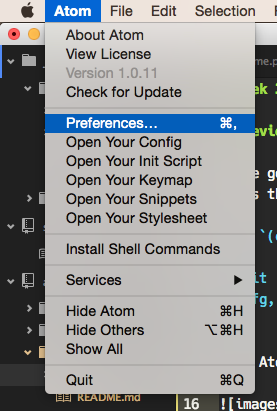

Click on the **Settings** menu, and paste the code in the *Ignored Names* list.

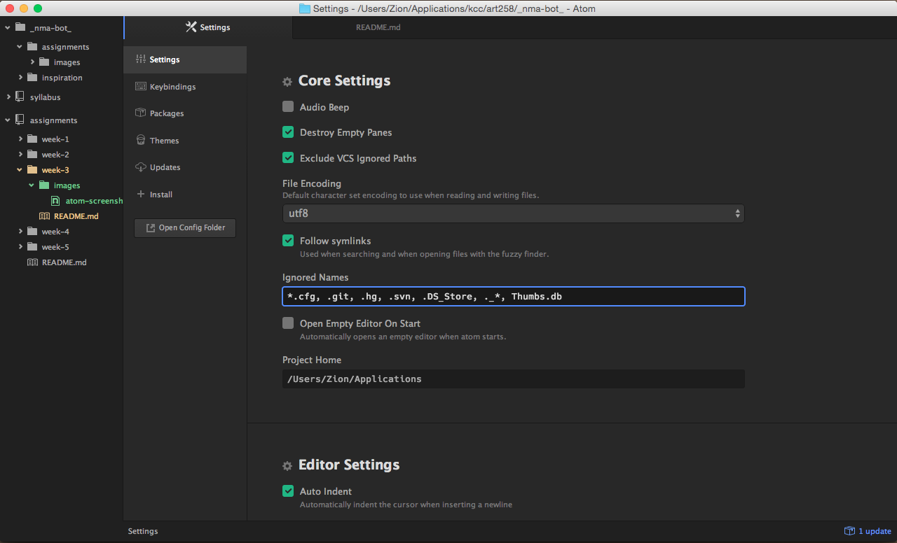

Click on the **Packages** menu, and type in `tree-view` in the *Installed Packages* input field. When the **tree-view** package appears under *Core Packages*, click on the settings button.

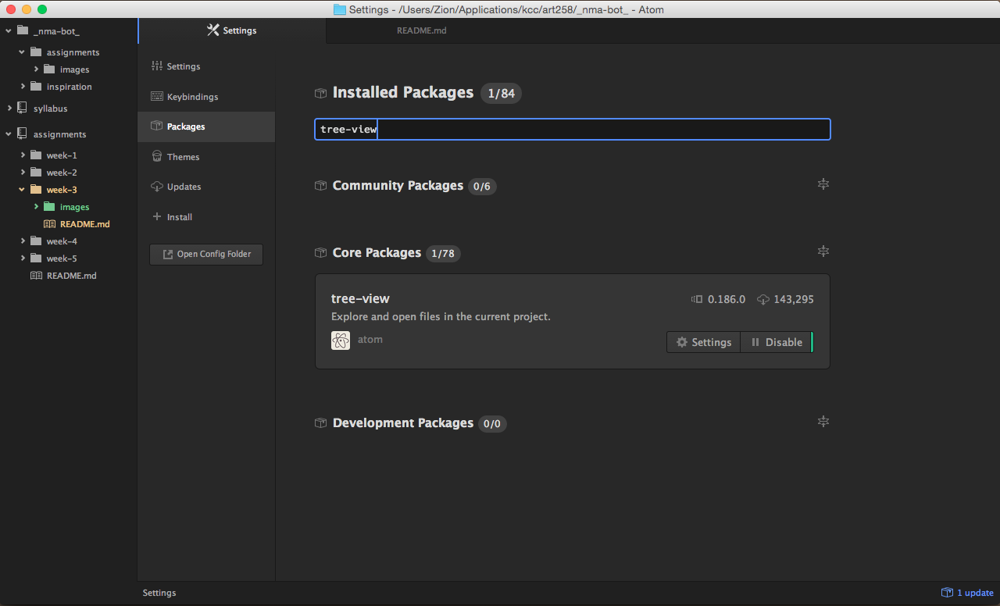

Under the Settings section, check *Hide Ignored Names*

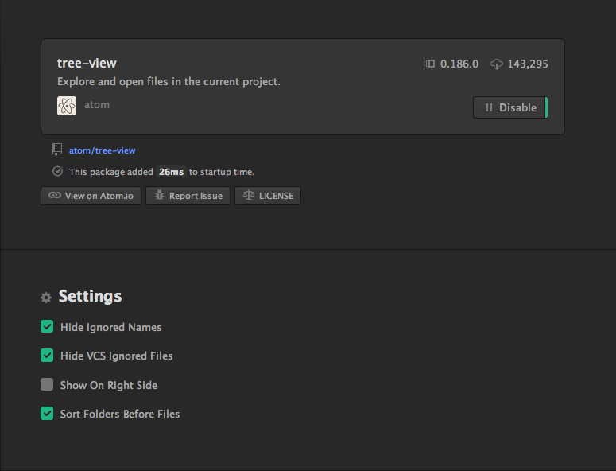

Now our configuration files won't get in the way!
