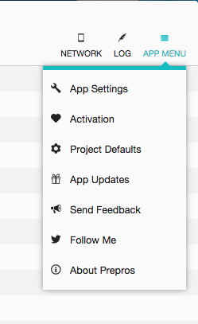
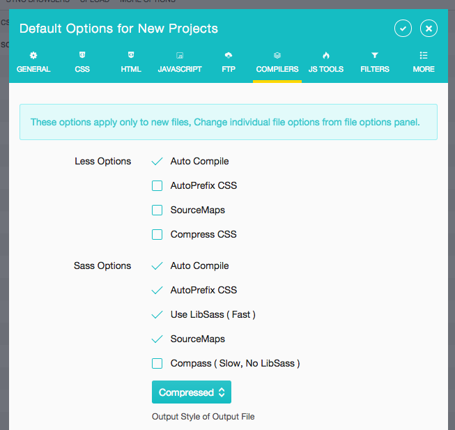
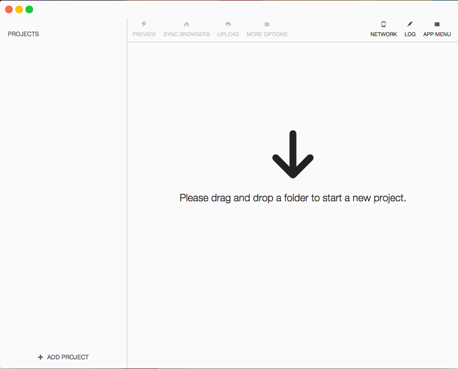

# Week 4: CSS Authoring using Sass


The concept of CSS authoring is based on using additional tools (ie. Prepros) and technologies (ie. Sass) to create a more maintainable and efficient workflow while developing. The final output from your tool's build process will be a compiled and compressed version of your CSS ready for the browser.

**Table of Contents**
<!-- START doctoc generated TOC please keep comment here to allow auto update -->
<!-- DON'T EDIT THIS SECTION, INSTEAD RE-RUN doctoc TO UPDATE -->


- [Preprocessors](#preprocessors)
- [*Prepros* as our build tool](#prepros-as-our-build-tool)
  - [Setup](#setup)
  - [Adding a new project](#adding-a-new-project)
- [Getting started with Sass](#getting-started-with-sass)
  - [Variables](#variables)
  - [Nesting](#nesting)
  - [Mixins](#mixins)
  - [Operators](#operators)
  - [Functions](#functions)

<!-- END doctoc generated TOC please keep comment here to allow auto update -->

## Preprocessors

One of the main technologies you'll interact with as a front-end developer will be CSS preprocessors.

Preprocessors make writing *maintainable* CSS easier. You can get more done, with less code, in less time. There are several popular preprocessors available to choose from including Sass, [LESS](http://lesscss.org/), and [Stylus](http://learnboost.github.io/stylus/). Each preprocessor has the same basic features and concepts:
- Be a *superset* of CSS, ie. valid CSS is valid Sass
- Support for variables, nesting, and basic math functions allowing for creation of [DRY](https://en.wikipedia.org/wiki/Don%27t_repeat_yourself) CSS

Today, the main thing that differs between the major preprocessors is code syntax and a few built-in functions. In this course we'll be focusing on Sass since it is well established and widely used within the community.

## *Prepros* as our build tool

There are several tools available to assist with managing the build process and generating our preprocessor's output including [Codekit](http://incident57.com/codekit/), [Scout](http://mhs.github.io/scout-app/), and command-line tools like [GruntJS](http://gruntjs.com/) and [GulpJS](http://gulpjs.com/). In this course, we'll be using Prepros which, along with compiling our Sass, also helps out with the following:

- CSS prefixing
- Browser refresh & behavior synchronization
- File concatenation & minification
- Image optimization


### Setup

So let's start by getting our environments setup for CSS authoring. We only have to do this step the first time we open Prepros

- Open Prepros (if you get a trial pop-up, just click okay)
- Click on *App Menu > Project Defaults*



- Under *Compilers > Sass*, make sure **Auto Compile, Autoprefix CSS, Use LibSass, and Sourcemaps** are checked and **Compressed** is selected in the dropdown for *Output style of Output file.*



### Adding a new project

Once you've adjusted the settings, drag & drop your project on to Prepros, or click the `+ Add Project` button on the bottom left corner.



That's it! Prepros will now watch our project for changes and generate the necessary output for us without any extra work. We'll come back to it later, but for now we can minimize the window to get out of our way.

## Getting started with Sass

It may seem daunting at first, but the main thing to remember is that Sass is CSS at it's core, so we can start slow and simple by converting our existing `style.css` to `style.scss`.


Once you re-save `style.scss`, you'll notice that two additional files appear, `style.css` and `style.css.map`.


*The `style.css.map` file is used by debugging tools like Chrome DevTools to read the compiled CSS and lookup the corresponding Sass file.*

We officially have Sass up and running!

### Variables

Variables are a way to store information that you want to reuse throughout your stylesheet. They are one of the critical pieces of making your development process DRY.

You can store things like colors, font stacks, or any CSS value you think you'll want to reuse. Sass uses the $ symbol to make something a variable. See the below CSS from our last class assignment for an example:

```css
.main-header {
  position: relative;
  height: 60px;
  background-color: green;
}

.logo {
  top: 0;
  left: 0;
  height: 60px;
  width: 100px;
  background-color: gray;
}

.main-nav {
  top: 0;
  right: 0;
  height: 60px;
  width: 400px;
  background-color: gray;
}
```

We can simplify this code by reference common values in a variable. For example, we use the value `60px` several times in the above code. If we wanted to change the size of our header, that means we would need to change that number 3 times in our stylesheet, which isn't very *DRY*.

Let's use a Sass variable to simplify our code and make it more efficient.

```scss
// Variables
$header-height: 60px;

.main-header {
  position: relative;
  height: $header-height;
  background-color: green;
}

.logo {
  top: 0;
  left: 0;
  height: $header-height;
  width: 100px;
  background-color: gray;
}

.main-nav {
  top: 0;
  right: 0;
  height: $header-height;
  width: 400px;
  background-color: gray;
}
```

Now if we want to update our header height, we only need to do it in one place. Go ahead and update the stylesheet by converting reused values to variables. A good rule of thumb: if a value (ie. color, number, string) is used 3 or more times anywhere in your stylesheet, it should be a variable.

### Nesting

One thing CSS is missing is a visual hierarchical structure that mimics HTML's nesting structure. Sass will let you nest your styles very much like HTML. When nesting there's 2 basic rules to follow: only be as specific as you need to be (ie. components), and do not nest more than three-levels deep (see [inception rule](http://thesassway.com/beginner/the-inception-rule) below).

Given our previous CSS, let's start with nesting the header.

```scss
// Variables
$header-height: 60px;

.main-header {
  position: relative;
  height: $header-height;
  background-color: green;

  .logo {
	top: 0;
	left: 0;
	height: $header-height;
	width: 100px;
	background-color: gray;
  }

  .main-nav {
	top: 0;
	right: 0;
	height: $header-height;
	width: 400px;
	background-color: gray;
  }
}
```

This will output the below CSS:

```css
.main-header {
  position: relative;
  height: 60px;
  background-color: green;
}

.main-header .logo {
  top: 0;
  left: 0;
  height: 60px;
  width: 100px;
  background-color: gray;
}

.main-header .main-nav {
  top: 0;
  right: 0;
  height: 60px;
  width: 400px;
  background-color: grey;
}
```

Take notice that the parent selector is prepended as an additional selector in the final styles output. This is significant because CSS performance is impacted negatively specifically from multi-selector style rules. So the general rule of nesting at max 3 levels is important to pay attention to.

Continue nesting the stylesheet by thinking in large components (ie. header, hero, info, footer).

References:
- [Nested selectors: the inception rule](http://thesassway.com/beginner/the-inception-rule)

### Mixins

Sometimes in CSS you want to reuse more than just a single value, but a whole set of style declarations or rules. Sass mixins fill this void, acting similarly to variables, but for whole sets of style rules.

A good example of when you would want to use a mixin from our current stylesheet would be our clearfix hack. If you have more than 1 section with floated content, then your HTML probably has several `cf` or `clearfix` classes being applied. This is fine, however the only reason we created that class is so that we could reuse the style without having to rewrite it for every selector that needs it in our CSS (**DRY CSS**, *WET HTML*).

With Sass, we can clean up our HTML while also keeping our Sass DRY using a mixin.

### Operators

### Functions
