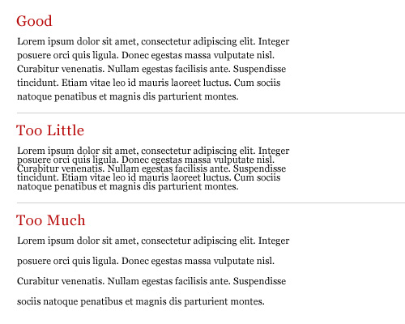
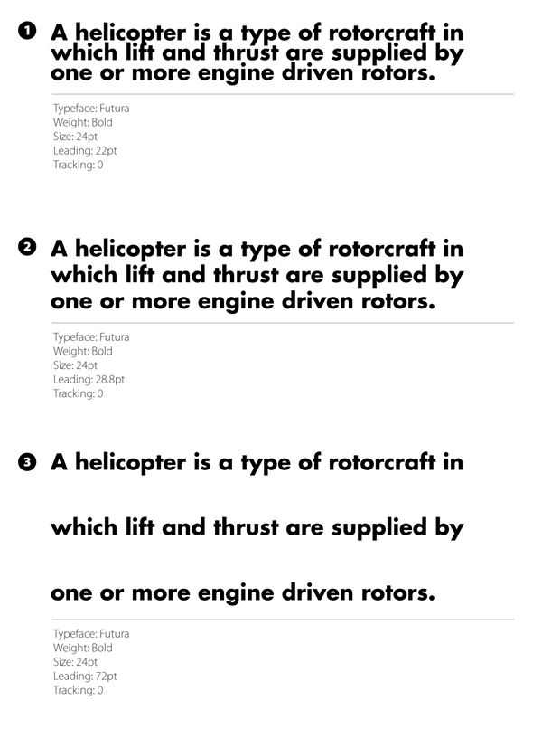

# Week 6: Enhancing Framework UI/UX

## Web Typography

Visual communication is the most important aspect of any design including web, and typography plays a critical role in that communication. However, the web presents the additional challenge of communicating across platforms. This makes font size, weight, color, leading (line-height), kerning (letter spacing), and balance all the more important components to consider when crafting a website. However, no differently than print, the difference between good typography and bad typography is work that looks professional versus work that looks amateur.

**Table of Contents**

<!-- START doctoc generated TOC please keep comment here to allow auto update -->
<!-- DON'T EDIT THIS SECTION, INSTEAD RE-RUN doctoc TO UPDATE -->
<!-- END doctoc generated TOC please keep comment here to allow auto update -->

- [Optimal line length](#optimal-line-length)

<!-- END doctoc generated TOC please keep comment here to allow auto update -->

### Line length
Similar to print, the otimal line length is **45-75 characters per line**. This increases overally readability and legibility of your text. However, because a line length of 65 characters may look different on an iPhone than on 27-inch monitor, your line-length should be fluid and adapt with your typographic scale and screen width.


_Credit: [Smashing Magazine](http://www.smashingmagazine.com/2009/04/8-simple-ways-to-improve-typography-in-your-designs/)_

**Pro Tip**
- A handy technique is to create a dummy paragraph element with lorem ipsum text, and drop in a `<span style="color: red;">*</span>` at the **45th** and **75th** characters. See below:

```html
<p>Lorem ipsum dolor sit amet, consectetur adip<span style="color: red;">*</span>isicing elit, sed do eiusmod <span style="color: red;">*</span>tempor incididunt ut labore et dolore magna aliqua.</p>
```

**References:**
- [CodePen Example: Line Length](http://codepen.io/micjamking/pen/7dde55eb8b327b51eb60302322c3e8a2)
- [Trent Walton: Fluid Type](http://trentwalton.com/2012/06/19/fluid-type/)

### Leading (line height)
Leading, or `line-height` in CSS, is simply the vertical space between rows of text in a paragraph. A proper line height helps increase legibility and establish a visual rhythm to the page.

Below are some basic, helpful principles to follow:
- The larger the text, the less leading is needed
- The longer the length, the more leading is needed
- The shorter the length, the less leading is needed


_Credit: [Smashing Magazine](http://www.smashingmagazine.com/2009/04/03/8-simple-ways-to-improve-typography-in-your-designs/)_


_Credit: [Design Instruct](http://designinstruct.com/tools-basics/the-basics-of-typography/)_

_Can you spot which is correct? Number 2 is the closest to have the optimal reading experience, but leading could be increased a bit more._

The simplest rule to follow is to set your `line-height` value **to 1.5 and adjust +-0.3 based on your the specific typeface and your `font-size`**. `line-height` is generally applied to the `body` element in CSS since that is where you typically establish your base font settings for your designs.

```css
body {
  ...
  line-height: 1.5;
}
```
_You'll notice that for `line-height` you can use a unitless value, ie. it doesn't need to be `px`, `%`, or `em/rem`. This means the number is just a simple multiplier (ie. one and a half times)_

Line height and width are always going to be relative to the typeface you are using, so use what you have learned and do your best to select the proper measurements.

Vertical Rhythm
Just as important and your vertical grid for layout, a baseline grid is essential for your type layout. This allows your readers to easily follow the flow of text by creating a continuous rhythm. This is very important to keep text on a consistent grid and I feel this is often the most difficult to achieve.


Credit: http://www.smashingmagazine.com/2009/04/03/8-simple-ways-to-improve-typography-in-your-designs/


Credit: http://code.tutsplus.com/tutorials/6-ways-to-improve-your-web-typography--net-6248 

To be consistent with vertical rhythm, spacing between elements and your line height should equal to the size of your baseline grid. Ie. If you baseline grid has a space of 20px, then your body line height to be 20px, your paragraph bottom margin should be set to be 20px, and your bottom margin for your headings should be equally measured.

Need help? Try these tools:

http://www.gridlover.net/app/ 
https://drewish.com/tools/vertical-rhythm/

Text Emphasis
Giving emphasis to a word or phrase without interrupting the reader is also important to think about. Italics, bolds, colors, small caps, sizes, underlines, and different typefaces are all different ways to emphasize text. Limit yourself to only using one at a time however.


Remember, when setting italics, use em for emphasis (not i tags) and strong for bold text (not b tags).

Text Rendering
Different browsers render type differently, even operating systems render your fonts differently. Although we can’t control every scenario, here are are some tips to help you if you are a stickler for details.

Optimize Legibility - Special characters and kerning are applied. Ligatures are also applied to words under 20px in size, if the font family has the proper characters. Although this is nice, it is cautioned when and where to use it because it will consume browser resources and may affect rendering time (think about your mobile users!)


Credit: http://css-tricks.com/almanac/properties/t/text-rendering/ 


Credit: http://css-tricks.com/almanac/properties/t/text-rendering/ 

Optimize Speed - Doing the opposite of the above, the browser emphasizes speed over legibility and disregards kerning or ligatures.

Samples:
p { text-rendering: optimizeLegibility; }
p { text-rendering: optimizeSpeed; }

Font Smoothing - This will help smooth out your fonts so they do not look bulky in your browser. These properties can only be applied in Google Chrome or Mozilla Firefox. If you are viewing your sites in Google Chrome or Mozilla Firefox, you will notice a significant change in your font weight when applying this.

Sample:
body { -webkit-font-smoothing: antialiased; -moz-osx-font-smoothing: grayscale; }


With vs. Without

Other optional hacks to make your text render smoother is to use a faint 1px text shadow or apply a text stroke. They are barely noticeable but they are worth experimenting with if you want.

My CodePen Examples

Other Items
Widows and orphans, hanging quotes, and rags are also items you may learn in typography class, but I feel that these are harder to control because of the type or amount of content your client may give you. Although not covered, you should be aware of it.

Sources:
http://www.smashingmagazine.com/2009/04/03/8-simple-ways-to-improve-typography-in-your-designs/ 
http://www.fonts.com/content/learning/fontology/level-2/text-typography/length-column-width
http://code.tutsplus.com/tutorials/6-ways-to-improve-your-web-typography--net-6248 
http://www.smashingmagazine.com/2012/04/24/a-closer-look-at-font-rendering/ 
http://blog.typekit.com/2010/10/15/type-rendering-operating-systems/
http://css-tricks.com/almanac/properties/t/text-rendering/